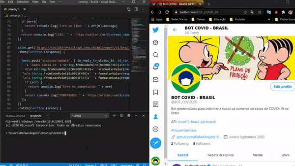

# BOT Twitter



BOT Twitter é um bot desenvolvido para fornecer informações atualizadas de casos de Corona Virus no Brasil, o bot utiliza da api externa [COVID-19 Brazil API](https://covid19-brazil-api.now.sh/)  para fornecerer essas informações
### Bibliotecas externas utilizadas
* [TwitterAPI](https://www.npmjs.com/package/twitter)
* [Dotenv](https://www.npmjs.com/package/dotenv)
### Instalação

BOT Twitter requer [Node.js](https://nodejs.org/) para ser executado

Instale as dependências e devDependencies e inicie o servidor.

```sh
$ cd BotGit
$ npm install 
$ node server.js
```

Para ambientes de produção ...

```sh
$ npm install --production
$ NODE_ENV=production node server.js
```
### Editando as chaves de desenvolvedor

Crie um arquivo *.env* na raiz do projeto, e adicione as seguintes variaveis com as  determinadas chaves de acesso chaves de acesso
```
1 BOT_CONSUMER_KEY=lGXmcbigvNxxxxxxxxxxxxxxxxx
2 BOT_CONSUMER_SECRET=iAAPWfTyJ756eGzOUZGxxxxxxxxxxxxxxxxxxxxxxx
3 BOT_ACCESS_TOKEN=1301576666376998912-xxxxxxxxxxxxxxxxxxxxxxxx
4 BOT_ACCESS_TOKEN_SECRET=KSDbQpMR9iBiwADxxxxxxxxxxxxxxxxxxxxxxxxxx
```
### Editando a palavra desejada para pesquisa

No arquivo server.js, altere a variavel *filtroPesquisa*, para a frase/palavra desejada
```
  // Declarando palavra desejada
   const filtroPesquisa = 'dados covid Brasil'
```
### Editando comentario 

No arquivo server.js, altere a valor do atributo json *status* para a frase/palavra desejada, lembrando de sempre marcar o @screen_name 
```
82  //Post Comentario / String.fromCodePoint (Emoji em Hexadecimal)
83  Tweet.post('statuses/update', {in_reply_to_status_id : id_str,status: 'Olá 
84  @' + screen_name + '.....'
```
### Atualmente Hosteado no [Heroku](https://dashboard.heroku.com)
